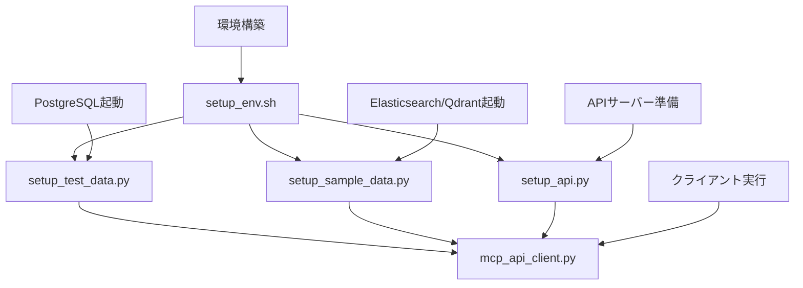

# MCP セットアップ・クライアントモジュール 一覧

## 📋 モジュール概要表

| モジュール名 | 主要な役割 | 処理概要 | 主要機能 |
|------------|-----------|----------|----------|
| **mcp_api_client.py** | MCP API クライアント | MCP APIサーバーとの通信を行うクライアントライブラリ | • 顧客・商品・注文の CRUD 操作<br>• 売上統計・分析機能<br>• エラーハンドリング<br>• 各種デモ実行機能<br>• Pandas連携サポート |
| **setup_api.py** | API環境セットアップ | MCP APIサーバーとクライアントの自動セットアップ | • Python バージョンチェック<br>• パッケージ自動インストール<br>• PostgreSQL接続確認<br>• APIサーバー起動・テスト<br>• デモファイル自動生成 |
| **setup_env.sh** | Streamlit環境セットアップ | Streamlitアプリケーション実行環境の構築 | • 環境確認（Python/pip/uv）<br>• requirements.txt生成<br>• 依存パッケージインストール<br>• .env テンプレート作成<br>• 構文チェック実行 |
| **setup_sample_data.py** | サンプルデータ投入 | Elasticsearch・Qdrant用のサンプルデータ作成 | • Elasticsearchブログ記事データ投入<br>• Qdrant商品ベクトルデータ投入<br>• インデックス・コレクション作成<br>• ダミーベクトル生成 |
| **setup_test_data.py** | PostgreSQLテストデータ投入 | PostgreSQL用のテストデータベース構築 | • テーブル作成（customers/products/orders）<br>• 顧客データ投入（10件）<br>• 商品データ投入（10件）<br>• 注文データ投入（100件）<br>• ランダムデータ生成 |

## 🔄 実行順序と依存関係


    style A fill:#e1f5fe
    style B fill:#f3e5f5
    style C fill:#f3e5f5
    style D fill:#e8f5e8
    style E fill:#fff3e0


## 📝 各モジュールの詳細機能

### 🔧 setup_api.py
**MCP APIサーバーとクライアントの完全自動セットアップ**

#### 主要機能
- ✅ **環境チェック**: Python 3.8+ バージョン確認
- 📦 **依存関係インストール**: FastAPI, Uvicorn, Pydantic等の自動インストール
- 🐘 **データベース確認**: PostgreSQL接続テスト・テーブル存在確認
- 🚀 **APIサーバー起動**: ポート8000での自動起動と待機
- 🧪 **エンドポイントテスト**: 全API機能の動作確認
- 📝 **デモファイル生成**: quick_test.py, Docker設定等の自動作成

#### 実行例
```bash
python setup_api.py
# → 1-9の選択メニューが表示
# → 全て自動でセットアップが完了
```

---

### 🎮 mcp_api_client.py
**包括的なAPIクライアントライブラリとデモ集**

#### 主要機能
- 🔗 **HTTP通信**: RESTful API との安全な通信処理
- 👥 **顧客管理**:
  - 一覧取得（都市フィルタ対応）
  - 新規顧客作成
  - 個別顧客情報取得
- 🛍️ **商品管理**:
  - カテゴリ・価格帯フィルタ
  - 商品詳細情報取得
- 📦 **注文管理**:
  - 注文履歴取得（顧客・商品フィルタ）
  - 新規注文作成
- 📊 **分析機能**:
  - 売上統計
  - 顧客別購入分析
  - 商品別売上ランキング
- 🐼 **Pandas連携**: DataFrame変換・データ分析
- ⚠️ **エラーハンドリング**: 詳細なエラー処理とデバッグ情報
- 🎪 **デモ機能**: 9種類の包括的なデモ

#### 利用可能なデモ
```python
# 実行すると以下のメニューが表示
1. 基本操作デモ
2. 売上分析デモ
3. 顧客分析デモ
4. データ作成デモ
5. Pandas連携デモ
6. エラーハンドリングデモ
7. パフォーマンステストデモ
8. インタラクティブデモ
9. 全てのデモを順番に実行
```

---

### 🏗️ setup_env.sh
**Streamlitアプリケーション環境の自動構築**

#### 主要機能
- 🐍 **環境確認**: Python, pip, uv の版数確認
- 📋 **requirements.txt生成**: 必要パッケージリストの自動作成
- 📥 **パッケージインストール**: uv または pip での自動インストール
- 🔑 **.env テンプレート**: 環境変数設定ファイルの自動生成
- ✅ **インストール確認**: 主要パッケージの導入状況チェック
- 🧪 **構文チェック**: Streamlitアプリの構文エラー確認

#### 生成される requirements.txt
```text
# Core packages
streamlit>=1.28.0
openai>=1.3.0
python-dotenv>=1.0.0

# Data processing
pandas>=2.0.0
numpy>=1.24.0
requests>=2.31.0

# Database clients
redis>=5.0.0
psycopg2-binary>=2.9.0
elasticsearch>=8.10.0
qdrant-client>=1.6.0

# Optional performance packages
watchdog>=3.0.0
```

---

### 📊 setup_sample_data.py
**Elasticsearch・Qdrant用サンプルデータ投入**

#### 主要機能
- 📰 **Elasticsearchデータ**:
  - ブログ記事インデックス作成
  - 5件のサンプル記事投入
  - 全文検索用データ準備
- 🔍 **Qdrantデータ**:
  - 商品ベクトルコレクション作成
  - 384次元ベクトル（sentence-transformers対応）
  - 5件の商品データ（ダミーベクトル付き）

#### サンプルデータ例
**Elasticsearch記事データ**:
- "Pythonプログラミング入門" (プログラミング)
- "機械学習の基礎" (AI・機械学習)
- "Docker入門ガイド" (インフラ)
- "Streamlitでダッシュボード作成" (プログラミング)
- "ElasticsearchとKibanaで分析" (データ分析)

**Qdrant商品データ**:
- ワイヤレスヘッドホン (エレクトロニクス)
- コーヒーメーカー (キッチン家電)
- ランニングシューズ (スポーツ)
- ビジネスバッグ (ファッション)
- スマートウォッチ (エレクトロニクス)

---

### 🐘 setup_test_data.py
**PostgreSQL用の包括的テストデータベース構築**

#### 主要機能
- 🏗️ **テーブル作成**: customers, products, orders テーブルの生成
- 👥 **顧客データ**: 10名の多様な顧客データ（全国主要都市）
- 🛍️ **商品データ**: 10商品（エレクトロニクス・家電・ファッション・スポーツ）
- 📦 **注文データ**: 100件のランダム注文（過去90日間）
- 🎲 **リアルなデータ**: 日本人名・実際的な価格設定・地域分散

#### 生成されるテーブル構造

**customers テーブル**
```sql
CREATE TABLE customers (
    id         SERIAL PRIMARY KEY,
    name       VARCHAR(100) NOT NULL,
    email      VARCHAR(100) UNIQUE NOT NULL,
    city       VARCHAR(50) NOT NULL,
    created_at TIMESTAMP DEFAULT CURRENT_TIMESTAMP
);
```

**products テーブル**
```sql
CREATE TABLE products (
    id             SERIAL PRIMARY KEY,
    name           VARCHAR(100) NOT NULL,
    category       VARCHAR(50) NOT NULL,
    price          DECIMAL(10,2) NOT NULL,
    stock_quantity INTEGER NOT NULL DEFAULT 0,
    created_at     TIMESTAMP DEFAULT CURRENT_TIMESTAMP
);
```

**orders テーブル**
```sql
CREATE TABLE orders (
    id           SERIAL PRIMARY KEY,
    customer_id  INTEGER REFERENCES customers(id),
    product_name VARCHAR(100) NOT NULL,
    quantity     INTEGER NOT NULL,
    price        DECIMAL(10,2) NOT NULL,
    order_date   DATE NOT NULL DEFAULT CURRENT_DATE,
    created_at   TIMESTAMP DEFAULT CURRENT_TIMESTAMP
);
```

## 🚀 完全セットアップ手順

### 1. 基本環境構築
```bash
# 環境のセットアップ
chmod +x setup_env.sh
./setup_env.sh
```

### 2. OpenAI API キー設定
```bash
# .envファイルを編集
echo "OPENAI_API_KEY=sk-your-api-key-here" >> .env
```

### 3. Dockerサービス起動
```bash
# 全サービス起動
docker-compose -f docker-compose.mcp-demo.yml up -d

# 個別起動（必要に応じて）
docker-compose -f docker-compose.mcp-demo.yml up -d postgres
docker-compose -f docker-compose.mcp-demo.yml up -d elasticsearch
docker-compose -f docker-compose.mcp-demo.yml up -d qdrant
```

### 4. テストデータ投入
```bash
# PostgreSQLテストデータ
python setup_test_data.py

# Elasticsearch・Qdrantサンプルデータ
python setup_sample_data.py
```

### 5. APIサーバーセットアップ
```bash
# 完全自動セットアップ
python setup_api.py
# メニューから選択（推奨: 9. 全てのデモを順番に実行）
```

### 6. Streamlitアプリ起動
```bash
# メインアプリケーション起動
streamlit run openai_api_mcp_sample.py --server.port=8501
```

## 📈 動作確認方法

### APIサーバー確認
```bash
# ヘルスチェック
curl http://localhost:8000/health

# APIドキュメント
open http://localhost:8000/docs
```

### クライアント動作確認
```bash
# 簡単なテスト
python quick_test.py

# 完全なデモ
python mcp_api_client.py
```

### Streamlitアプリ確認
```bash
# ブラウザでアクセス
open http://localhost:8501
```

## 🛠️ トラブルシューティング

### よくある問題と解決方法

| 問題 | 症状 | 解決方法 |
|-----|------|----------|
| **PostgreSQL接続エラー** | `psycopg2.OperationalError` | `docker-compose -f docker-compose.mcp-demo.yml up -d postgres` |
| **APIサーバー起動失敗** | `Port 8000 already in use` | `lsof -i :8000` でプロセス確認・終了 |
| **パッケージ不足** | `ModuleNotFoundError` | `./setup_env.sh` を再実行 |
| **OpenAI API エラー** | `Authentication failed` | `.env` ファイルの `OPENAI_API_KEY` 確認 |
| **データが表示されない** | 空のテーブル | `python setup_test_data.py` を再実行 |

## 📚 参考リンク

- **API ドキュメント**: http://localhost:8000/docs
- **Streamlit アプリ**: http://localhost:8501
- **PostgreSQL**: http://localhost:5432
- **Elasticsearch**: http://localhost:9200
- **Qdrant**: http://localhost:6333

---

**📄 このドキュメントについて**
MCP (Model Context Protocol) プロジェクトのセットアップとクライアントモジュールの包括的な説明書です。
全モジュールを順番に実行することで、OpenAI APIと各種データベースを連携したデモ環境が完成します。
