# 📋 mcp_qdrant.py 設計書

## 📝 目次

1. [📖 概要書](#📖-概要書)
2. [🔧 システム構成](#🔧-システム構成)
3. [📋 関数一覧](#📋-関数一覧)
4. [📑 関数詳細設計](#📑-関数詳細設計)
5. [⚙️ 技術仕様](#⚙️-技術仕様)
6. [🚨 エラーハンドリング](#🚨-エラーハンドリング)

---

## 📖 概要書

### 🎯 処理の概要

**MCP経由Qdrantベクトルデータベースセマンティック検索アプリケーション**

mcp_qdrant.pyは、MCP (Model Context Protocol) 経由でQdrantベクトルデータベースに自然言語でアクセスするStreamlitアプリケーションです。OpenAI Embeddings APIを使用してテキストを384次元ベクトルに変換し、自然言語クエリを高度なセマンティック検索戦略に変換して、意味的類似性に基づく高精度なベクトル検索を実現する革新的な検索システムです。

#### 🌟 主要機能カテゴリ

| カテゴリ | 機能群 | 説明 |
|---------|--------|------|
| 🔍 **セマンティック検索** | AI駆動ベクトル検索 | OpenAI embeddingsによる意味的類似性検索 |
| 📊 **ベクトル管理** | 384次元ベクトル処理 | 次元調整・ベクトル変換・類似度計算 |
| 🎯 **検索戦略AI** | 検索戦略生成 | 自然言語→JSON検索戦略変換・ハイブリッド検索 |
| 🤖 **MCP統合** | プロトコル準拠通信 | MCP Server経由でのQdrant操作 |

#### 🔄 セマンティック検索処理フロー

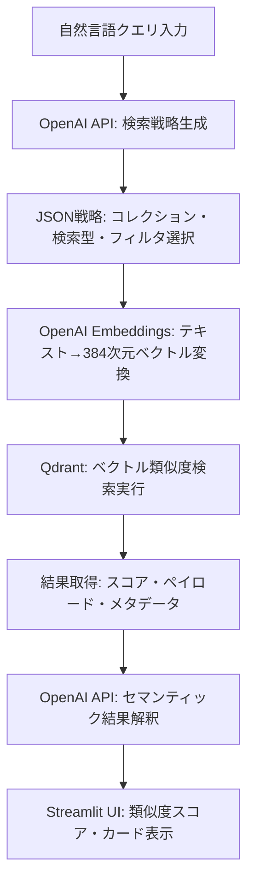

### 🔄 主要処理の流れ（MCP+Qdrant）

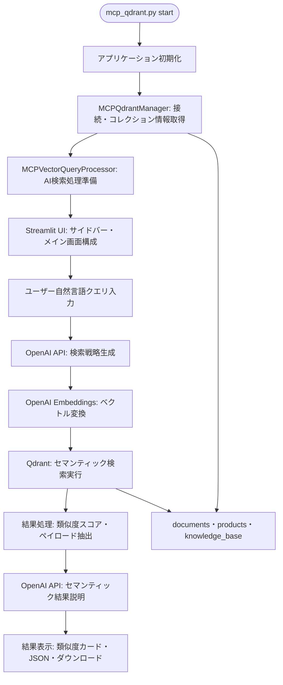

---

## 🔧 システム構成

### 📦 主要コンポーネント

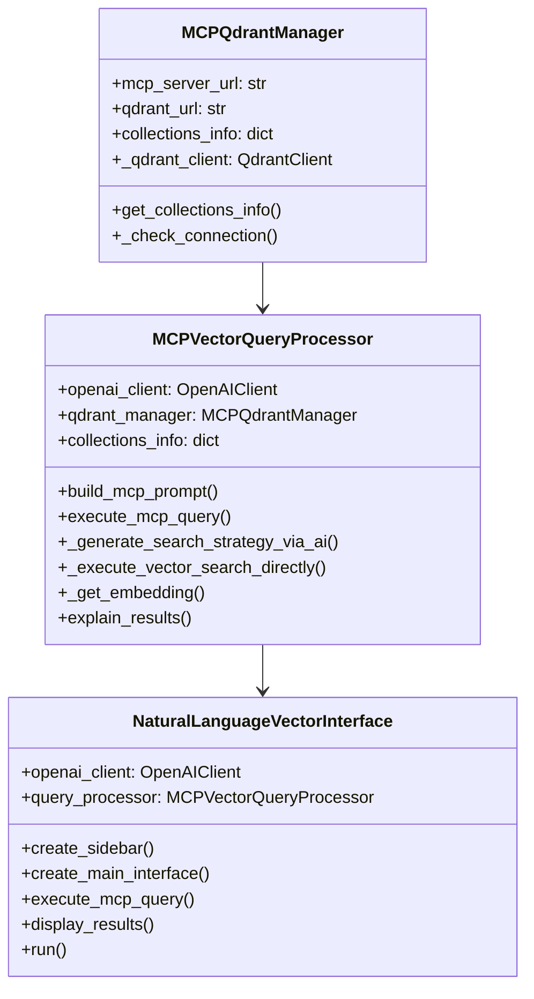

### 📋 データフロー（ベクトル検索）

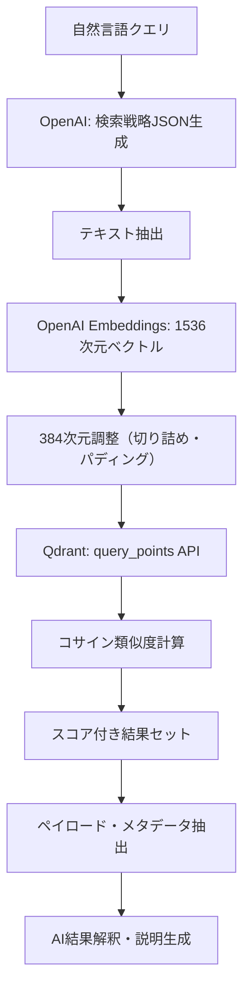

---

## 📋 関数一覧

### 🏗️ MCPQdrantManager クラス

| 関数名 | 分類 | 処理概要 | 重要度 |
|--------|------|----------|---------| 
| `__init__()` | 🔧 初期化 | MCP・Qdrant URL設定・クライアント初期化 | ⭐⭐⭐ |
| `get_collections_info()` | 📊 データ取得 | コレクション情報取得・キャッシュ管理 | ⭐⭐⭐ |
| `_check_connection()` | 🔍 接続確認 | Qdrantクライアント接続確認・ヘルスチェック | ⭐⭐ |

### 🤖 MCPVectorQueryProcessor クラス

| 関数名 | 分類 | 処理概要 | 重要度 |
|--------|------|----------|---------| 
| `build_mcp_prompt()` | 📝 プロンプト構築 | MCP用検索戦略プロンプト生成 | ⭐⭐⭐ |
| `execute_mcp_query()` | 🚀 実行制御 | AI検索戦略→ベクトル検索実行統括 | ⭐⭐⭐ |
| `_generate_search_strategy_via_ai()` | 🧠 AI戦略生成 | 自然言語→JSON検索戦略変換 | ⭐⭐⭐ |
| `_execute_vector_search_directly()` | 🔍 ベクトル検索 | Qdrant直接ベクトル検索実行 | ⭐⭐⭐ |
| `_get_embedding()` | 📊 ベクトル変換 | OpenAI Embeddings→384次元変換 | ⭐⭐⭐ |
| `explain_results()` | 💬 結果解釈 | AI による検索結果説明生成 | ⭐⭐ |

### 🎨 NaturalLanguageVectorInterface クラス

| 関数名 | 分類 | 処理概要 | 重要度 |
|--------|------|----------|---------| 
| `create_sidebar()` | 🎨 UI構築 | サイドバー（モデル選択・コレクション情報・履歴）| ⭐⭐ |
| `create_main_interface()` | 🎨 UI構築 | メインインターフェース（クエリ入力・候補・結果表示）| ⭐⭐⭐ |
| `execute_mcp_query()` | 🚀 実行管理 | クエリ実行・結果表示統括 | ⭐⭐⭐ |
| `display_results()` | 📊 結果表示 | ベクトル検索結果カード表示・類似度表示 | ⭐⭐⭐ |
| `run()` | 🏗️ 主処理 | アプリケーション全体実行・UI統合 | ⭐⭐⭐ |

### 🔧 ヘルパー関数

| 関数名 | 分類 | 処理概要 | 重要度 |
|--------|------|----------|---------| 
| `main()` | 🎯 エントリー | アプリケーション起動・設定初期化 | ⭐⭐⭐ |
| `load_dotenv()` | ⚙️ 環境設定 | 環境変数読み込み・設定管理 | ⭐⭐⭐ |

---

## 📑 関数詳細設計

### 🏗️ MCPQdrantManager.__init__()

#### 🎯 処理概要
MCP・Qdrant接続設定とクライアント初期化を行うコンストラクタ

#### 📊 処理の流れ
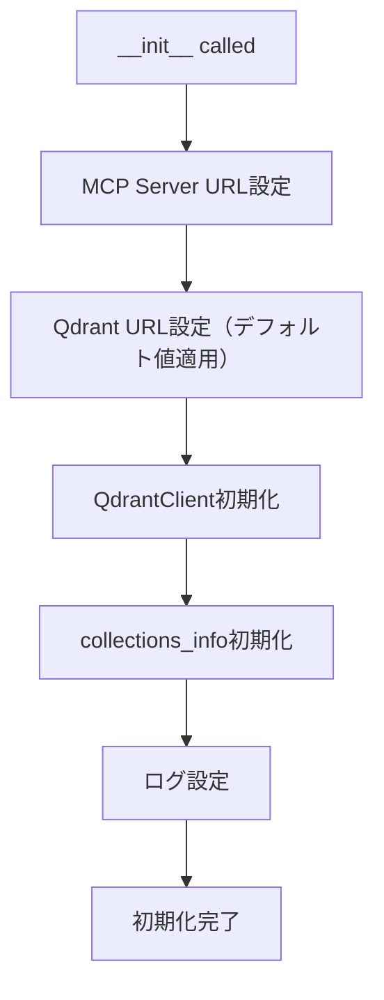

#### 📋 IPO設計

| 項目 | 内容 |
|------|------|
| **INPUT** | mcp_server_url: str, qdrant_url: str |
| **PROCESS** | URL設定 → QdrantClient作成 → 属性初期化 |
| **OUTPUT** | MCPQdrantManagerインスタンス |

#### 🔧 実装詳細

```python
def __init__(self, mcp_server_url: str, qdrant_url: str = None):
    self.mcp_server_url = mcp_server_url
    self.qdrant_url = qdrant_url or os.getenv('QDRANT_URL', 'http://localhost:6333')
    
    # QdrantClient初期化
    try:
        from qdrant_client import QdrantClient
        self._qdrant_client = QdrantClient(url=self.qdrant_url)
    except ImportError:
        self._qdrant_client = None
        logger.warning("qdrant-clientがインストールされていません")
```

---

### 🔍 MCPVectorQueryProcessor._get_embedding()

#### 🎯 処理概要
OpenAI Embeddings APIでテキストを384次元ベクトルに変換する重要な関数

#### 📊 処理の流れ
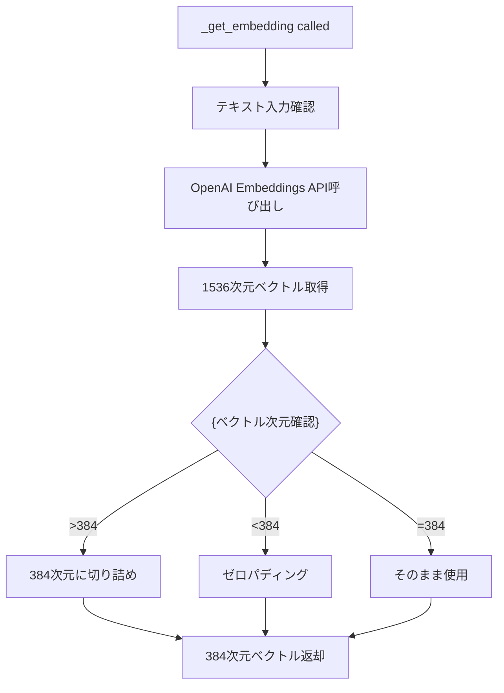

#### 📋 IPO設計

| 項目 | 内容 |
|------|------|
| **INPUT** | text: str（検索対象テキスト） |
| **PROCESS** | OpenAI API呼び出し → 1536次元取得 → 384次元調整 |
| **OUTPUT** | List[float]（384次元ベクトル）または None |

#### 🔧 ベクトル次元調整戦略

```python
def _get_embedding(self, text: str) -> Optional[List[float]]:
    try:
        # OpenAI Embeddings API（text-embedding-3-small）
        response = self.openai_client.client.embeddings.create(
            input=text,
            model="text-embedding-3-small"  # 1536次元
        )
        embedding = response.data[0].embedding
        
        # Qdrant用384次元調整
        if len(embedding) > 384:
            embedding = embedding[:384]  # 切り詰め
        elif len(embedding) < 384:
            embedding.extend([0.0] * (384 - len(embedding)))  # ゼロパディング
        
        return embedding
    except Exception as e:
        logger.error(f"Embedding generation error: {e}")
        return None
```

---

### 🧠 MCPVectorQueryProcessor._generate_search_strategy_via_ai()

#### 🎯 処理概要
自然言語クエリをJSONベクトル検索戦略に変換するAI駆動関数

#### 📊 処理の流れ
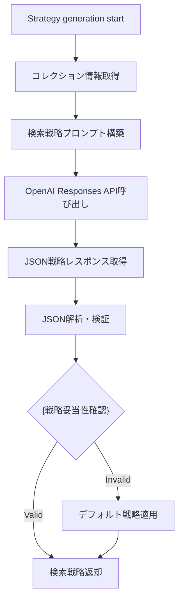

#### 📋 IPO設計

| 項目 | 内容 |
|------|------|
| **INPUT** | user_query: str, model: str |
| **PROCESS** | プロンプト構築 → OpenAI API → JSON解析 → 妥当性確認 |
| **OUTPUT** | dict（JSON検索戦略）またはデフォルト戦略 |

#### 🎯 検索戦略JSON仕様

```json
{
    "collection": "products|documents|knowledge_base",
    "query_type": "semantic_search|filter_search|hybrid_search",
    "search_text": "ベクトル検索用テキスト",
    "filters": {"category": "エレクトロニクス"},
    "limit": 10,
    "description": "検索戦略の詳細説明"
}
```

---

### 🔍 MCPVectorQueryProcessor._execute_vector_search_directly()

#### 🎯 処理概要
QdrantのベクトルDBに対して直接セマンティック検索を実行する核心関数

#### 📊 処理の流れ
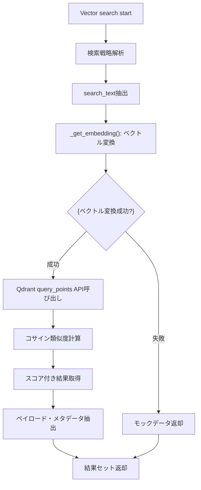

#### 📋 IPO設計

| 項目 | 内容 |
|------|------|
| **INPUT** | search_strategy: dict（JSON検索戦略） |
| **PROCESS** | ベクトル変換 → Qdrant検索 → 類似度計算 → 結果整形 |
| **OUTPUT** | List[dict]（スコア・ペイロード付き検索結果） |

#### 🔧 Qdrant API実行詳細

```python
# 新しいQdrant APIを使用（query_points）
search_result = self.qdrant_manager._qdrant_client.query_points(
    collection_name=collection_name,
    query=search_vector,  # 384次元ベクトル
    limit=limit,
    with_payload=True,    # ペイロード情報含む
    score_threshold=0.5   # 類似度しきい値
)

# 結果整形
results = []
for point in search_result.points:
    results.append({
        'id': point.id,
        'score': point.score,
        'payload': point.payload
    })
```

---

### 🎨 NaturalLanguageVectorInterface.display_results()

#### 🎯 処理概要
ベクトル検索結果を類似度スコア付きカード形式で美しく表示する関数

#### 📊 処理の流れ
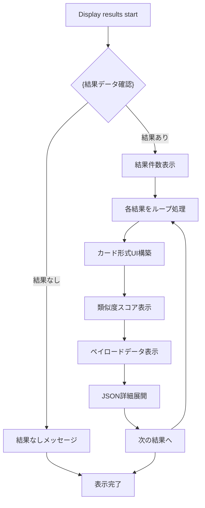

#### 📋 IPO設計

| 項目 | 内容 |
|------|------|
| **INPUT** | results: List[dict], explanation: str |
| **PROCESS** | 結果確認 → カード表示 → スコア表示 → ペイロード表示 |
| **OUTPUT** | Streamlit UI表示（カード・メトリクス・JSON） |

#### 🎨 UI表示仕様

```python
def display_results(self, results: List[dict], explanation: str = ""):
    if not results:
        st.warning("🔍 検索結果が見つかりませんでした")
        return

    st.success(f"🎯 {len(results)}件の類似結果が見つかりました")
    
    for i, result in enumerate(results):
        with st.container():
            # カード形式表示
            st.markdown(f"### 📄 結果 {i+1}")
            
            # 類似度スコア（重要指標）
            score = result.get('score', 0)
            st.metric("類似度", f"{score:.3f}")
            
            # ペイロード情報表示
            payload = result.get('payload', {})
            for key, value in payload.items():
                st.write(f"**{key}**: {value}")
            
            # JSON詳細情報（展開可能）
            with st.expander("📋 詳細情報"):
                st.json(result)
```

---

## ⚙️ 技術仕様

### 📦 依存ライブラリ

| ライブラリ | バージョン | 用途 | 重要度 |
|-----------|-----------|------|---------| 
| `streamlit` | >=1.48.0 | 🌐 Webアプリケーションフレームワーク | ⭐⭐⭐ |
| `openai` | >=1.99.9 | 🤖 OpenAI API統合（Embeddings・Responses） | ⭐⭐⭐ |
| `qdrant-client` | 最新 | 🔍 Qdrantベクトルデータベースクライアント | ⭐⭐⭐ |
| `helper_api` | 内部 | 🔧 OpenAI APIクライアント・ResponseProcessor | ⭐⭐⭐ |
| `helper_mcp` | 内部 | 📱 MCPSessionManager | ⭐⭐⭐ |
| `helper_st` | 内部 | 🎨 Streamlit UIヘルパー | ⭐⭐ |

### 🚀 実行環境仕様

#### 📋 実行方法

```bash
# 基本実行
streamlit run mcp_qdrant.py --server.port=8505

# Docker環境での実行
docker-compose -f docker-compose/docker-compose.mcp-demo.yml up -d qdrant
streamlit run mcp_qdrant.py --server.port=8505

# Qdrant MCP サーバー確認
curl http://localhost:8003/mcp
```

#### ⚙️ 環境変数設定

```yaml
Required_Environment_Variables:
  OPENAI_API_KEY: "OpenAI API key for embeddings"
  QDRANT_URL: "Qdrant server URL (default: http://localhost:6333)"
  QDRANT_MCP_URL: "MCP server URL (default: http://localhost:8003/mcp)"
```

#### 📄 設定ファイル構造

```yaml
# .env ファイル例
OPENAI_API_KEY=your_openai_api_key_here
QDRANT_URL=http://localhost:6333
QDRANT_MCP_URL=http://localhost:8003/mcp
```

### 🔍 Qdrantコレクション仕様

#### 📋 デフォルトコレクション

```yaml
Collections_Configuration:
  documents:
    description: "文書の埋め込みベクトルコレクション"
    vector_size: 384
    distance: "cosine"
    fields: ["title", "content", "category", "timestamp", "author"]
    sample_count: 100
  
  products:
    description: "商品の埋め込みベクトルコレクション"
    vector_size: 384
    distance: "cosine"
    fields: ["ID", "name", "category", "description", "price"]
    sample_count: 5
  
  knowledge_base:
    description: "知識ベースの埋め込みベクトルコレクション"
    vector_size: 384
    distance: "cosine"
    fields: ["topic", "content", "tags", "difficulty_level", "source"]
    sample_count: 200
```

#### 📊 ベクトル次元管理

```yaml
Vector_Dimension_Management:
  openai_embedding:
    model: "text-embedding-3-small"
    dimensions: 1536
    description: "OpenAI標準埋め込み次元"
  
  qdrant_collection:
    dimensions: 384
    description: "Qdrant最適化次元"
    adjustment: "自動切り詰め・ゼロパディング"
  
  similarity_metric:
    type: "cosine"
    range: "[-1, 1]"
    threshold: 0.5
```

### 🧠 AI検索戦略仕様

#### 📋 検索戦略タイプ

```yaml
Search_Strategy_Types:
  semantic_search:
    description: "セマンティック類似性検索"
    vector_required: true
    filters_optional: true
    
  filter_search:
    description: "フィルタベース検索"
    vector_required: false
    filters_required: true
    
  hybrid_search:
    description: "セマンティック＋フィルタ複合検索"
    vector_required: true
    filters_required: true
```

#### 🎯 プロンプト設計

```python
strategy_prompt_template = """
あなたはベクトル検索の専門家です。以下の自然言語クエリを分析し、
最適なQdrantベクトル検索戦略をJSON形式で生成してください。

利用可能なコレクション: {collections}
ユーザークエリ: {user_query}

JSON戦略形式:
{{
    "collection": "適切なコレクション名",
    "query_type": "semantic_search|filter_search|hybrid_search",
    "search_text": "ベクトル検索用テキスト",
    "filters": {{}},
    "limit": 10,
    "description": "検索戦略の説明"
}}
"""
```

### 🎨 Streamlit UI仕様

#### 📋 ページ設定

```python
Streamlit_Configuration:
  page_title: "MCP Qdrant ベクトル検索デモ"
  page_icon: "🔍"
  layout: "wide"
  initial_sidebar_state: "expanded"
```

#### 🎨 UI コンポーネント設計

```yaml
UI_Components:
  sidebar:
    - model_selection: "OpenAIモデル選択（gpt-4o-mini等）"
    - collection_info: "Qdrantコレクション構造表示"
    - query_history: "過去5件のベクトル検索履歴"
  
  main_interface:
    - api_info_expander: "OpenAI・MCP動作説明"
    - query_candidates: "12個のセマンティック検索例ボタン"
    - query_input: "自然言語クエリ入力フィールド"
    - results_display: "類似度スコア付きカード表示"
```

### 🔄 MCP統合仕様

#### 📋 MCP通信プロトコル

```yaml
MCP_Integration:
  server_endpoint: "http://localhost:8003/mcp"
  protocol: "HTTP/SSE"
  authentication: "none"
  
  request_format:
    method: "POST"
    headers: 
      Content-Type: "application/json"
    body:
      query: "natural_language_query"
      strategy: "generated_json_strategy"
  
  response_format:
    status: "success|error"
    data: "vector_search_results"
    metadata: "collection_info"
```

#### 🏗️ アーキテクチャ統合

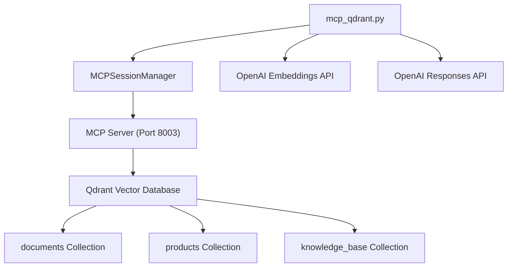

---

## 🚨 エラーハンドリング

### 📋 エラーカテゴリ

#### 🔍 Qdrant接続関連エラー

| エラー種別 | 原因 | 対処法 | 影響度 |
|-----------|------|--------|---------| 
| **Qdrantクライアント未インストール** | 📦 `pip install qdrant-client` 未実行 | 警告表示・モックデータで継続 | 🟡 中 |
| **Qdrantサーバー未起動** | 🐳 Docker Compose未実行・サーバーダウン | 接続エラー表示・モックデータ提供 | 🟡 中 |
| **コレクション存在しない** | 🗄️ 指定コレクション未作成 | デフォルトコレクション作成指示 | 🟠 低 |
| **ベクトル次元不一致** | 📊 コレクション設定と埋め込み次元の相違 | 自動次元調整・警告表示 | 🟠 低 |

#### 🤖 OpenAI API関連エラー

| エラー種別 | 原因 | 対処法 | 影響度 |
|-----------|------|--------|---------| 
| **Embeddings API制限** | 🔑 レート制限・API キー制限 | 再試行・代替戦略提案 | 🟡 中 |
| **Embeddings生成失敗** | 🚫 API エラー・ネットワーク問題 | エラー表示・フォールバック検索 | 🟡 中 |
| **Responses API制限** | 📞 GPT-4制限・トークン制限 | 軽量モデル切り替え・警告表示 | 🟠 低 |
| **JSON解析エラー** | 🔧 AI生成戦略の構文エラー | デフォルト戦略適用・構文修正 | 🟠 低 |

#### 📱 MCP統合関連エラー

| エラー種別 | 原因 | 対処法 | 影響度 |
|-----------|------|--------|---------| 
| **MCP サーバー未起動** | 🐳 Docker コンテナ未起動 | MCP 起動指示・直接接続フォールバック | 🟡 中 |
| **MCP通信タイムアウト** | ⏰ ネットワーク遅延・サーバー負荷 | 直接Qdrant接続・警告表示 | 🟠 低 |
| **MCP プロトコルエラー** | 🔧 リクエスト形式エラー・バージョン不一致 | プロトコル修正・代替通信 | 🟠 低 |

#### 🎨 UI・表示関連エラー

| エラー種別 | 原因 | 対処法 | 影響度 |
|-----------|------|--------|---------| 
| **Streamlitポート競合** | 🌐 8505ポート使用中 | 代替ポート指示・ポート変更 | 🟠 低 |
| **結果表示エラー** | 📊 大容量データ・フォーマットエラー | 表示件数制限・エラー結果スキップ | 🟠 低 |
| **JSON表示エラー** | 🔧 不正JSON・大容量データ | プレーンテキスト表示・省略表示 | 🟠 低 |

### 🛠️ エラーハンドリング戦略

#### 🔧 多層フォールバック戦略

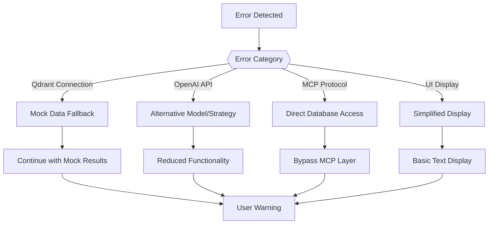

#### 🎯 段階的エラー対応

```python
# Qdrant接続エラー（段階的フォールバック）
def _execute_vector_search_directly(self, search_strategy: dict):
    try:
        # 主戦略: Qdrant直接アクセス
        return self._qdrant_direct_search(search_strategy)
    except QdrantConnectionError:
        st.warning("⚠️ Qdrantサーバーに接続できません。モックデータを使用します。")
        return self._get_mock_search_results(search_strategy)
    except Exception as e:
        logger.error(f"Vector search error: {e}")
        return []

# OpenAI Embeddings エラー（代替戦略）
def _get_embedding(self, text: str) -> Optional[List[float]]:
    try:
        # 主戦略: text-embedding-3-small
        return self._openai_embedding_primary(text)
    except OpenAIRateLimitError:
        st.warning("⚠️ OpenAI API制限に達しました。少し待ってから再試行してください。")
        time.sleep(2)
        return self._openai_embedding_retry(text)
    except Exception as e:
        logger.error(f"Embedding generation error: {e}")
        return None
```

#### ✅ ユーザーフレンドリーなエラーメッセージ

```python
# Qdrant関連エラー
st.error("🔍 Qdrantベクトルデータベースに接続できません")
st.info("💡 解決方法:\n1. Docker Composeでサービスを起動\n2. Qdrantクライアントをインストール")
st.code("docker-compose -f docker-compose/docker-compose.mcp-demo.yml up -d qdrant")

# OpenAI API制限エラー
st.warning("🤖 OpenAI API制限のため、軽量モデルに切り替えます")
st.info("💰 コスト削減のため、一部機能を制限しています")

# ベクトル次元エラー
st.warning("📊 ベクトル次元を自動調整しました")
st.info(f"🔧 {original_dim}次元 → 384次元（Qdrant最適化）")
```

#### 🚨 復旧手順ガイド

```yaml
Recovery_Procedures:
  qdrant_connection:
    step1: "Docker Composeでqdrantサービス起動"
    step2: "http://localhost:6333/collections で接続確認"
    step3: "必要に応じてqdrant-clientインストール"
    command: "docker-compose -f docker-compose/docker-compose.mcp-demo.yml up -d qdrant"
  
  openai_embeddings:
    step1: "OPENAI_API_KEY環境変数確認"
    step2: "APIキーの有効性・残高確認"
    step3: "レート制限時間待機"
    fallback: "軽量モデル・代替戦略使用"
  
  mcp_protocol:
    step1: "MCP サーバー起動確認（ポート8003）"
    step2: "curl http://localhost:8003/mcp でヘルスチェック"
    step3: "直接Qdrantアクセスフォールバック"
  
  vector_dimensions:
    step1: "コレクション設定確認（384次元）"
    step2: "OpenAI embeddingsモデル確認"
    step3: "自動次元調整機能確認"
```

#### 📊 エラーログとモニタリング

```python
# 構造化ログ出力
logger = logging.getLogger(__name__)

# エラーログ記録
logger.error(f"Qdrant search failed", extra={
    "collection": collection_name,
    "query_text": search_text,
    "error_type": "connection_error",
    "fallback_used": "mock_data"
})

# パフォーマンスログ
logger.info(f"Vector search completed", extra={
    "results_count": len(results),
    "search_time": elapsed_time,
    "similarity_scores": [r['score'] for r in results[:3]]
})
```

---

## 🎉 まとめ

この設計書は、**mcp_qdrant.py** の完全な技術仕様と実装詳細を記載した包括的なドキュメントです。

### 🌟 設計のハイライト

- **🔍 最先端セマンティック検索**: OpenAI Embeddings + QdrantベクトルDB
- **🧠 AI駆動検索戦略**: 自然言語→JSON戦略の自動変換
- **📊 高度なベクトル処理**: 384次元最適化・コサイン類似度計算
- **🛡️ 多層エラーハンドリング**: モックデータフォールバック・段階的復旧

### 🔧 アーキテクチャ特徴

- **📦 モジュール化設計**: MCPQdrantManager・MCPVectorQueryProcessor分離
- **⚙️ 柔軟な設定管理**: 環境変数・コレクション・モデル選択対応
- **🤖 複数AI統合**: Embeddings・Responses API の効率活用
- **🌐 スケーラブルUI**: Streamlit によるリアルタイム検索体験

### 📈 セマンティック検索価値

- **🧠 意味理解検索**: キーワード一致を超えた概念的類似性
- **🔄 ハイブリッド戦略**: ベクトル検索・フィルタリング・複合検索
- **📊 精密類似度**: コサイン類似度による定量的関連度評価
- **🎯 コンテキスト対応**: 文脈を考慮した高精度検索結果

### 🚀 拡張可能性

- 🔄 新しいコレクション・ベクトル次元対応
- 🧠 高度な検索戦略・マルチモーダル埋め込み
- 📊 リアルタイム学習・ユーザーフィードバック統合
- 🌐 分散ベクトル検索・クラスタリング対応
- 🔐 セキュリティ強化・アクセス制御機能